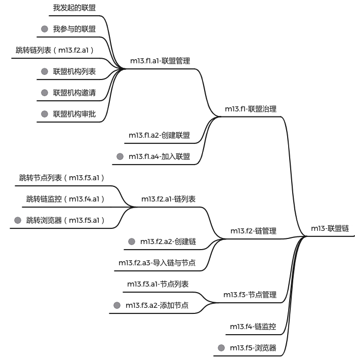
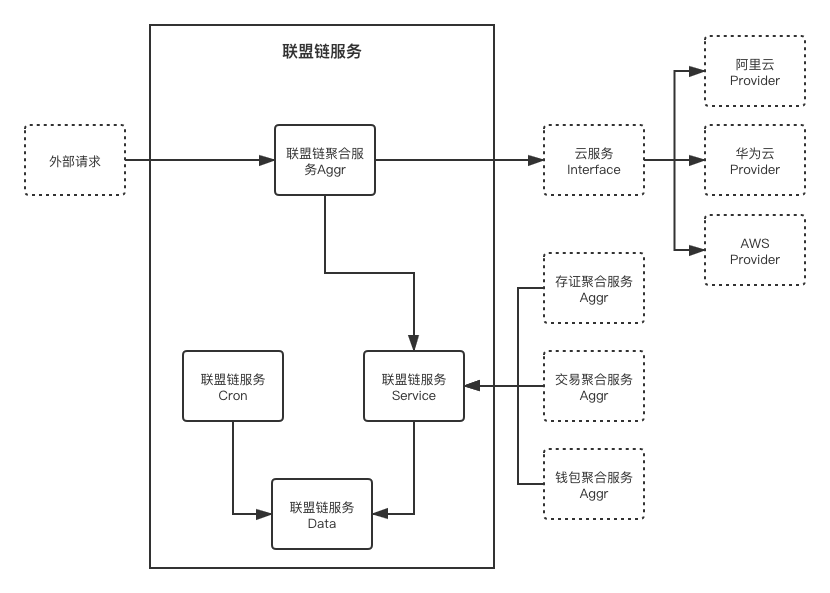

# Qilin-BaaS 联盟链服务

## 一、设计概述

联盟链服务提供链服生态中联盟治理，链与节点管理与监控的基础服务，给客户提供自建底层区块链及节点的能力，是链服平台中所有区块链服务都会依赖的核心服务。

### 功能概述

系统主要功能包括：

- 联盟治理：
    - 联盟管理
    - 创建联盟
    - 加入联盟

- 链管理：
    - 链列表
    - 创建链
    - 导入链与节点

- 节点管理：
    - 节点列表
    - 创建节点

- 链监控：

- 浏览器：



使⽤者包括：

- 链服平台中所有区块链服务

### ⾮功能约束

……系统未来预计⼀年⽤户量达到……， ⽇订单量达到……， ⽇PV达到……， 图⽚数量达到 ……。

1. 查询性能⽬标：平均响应时间<300ms，95%响应时间<500ms，单机TPS>100； 2. 下单性能⽬标：平均响应时间<800ms，95%响应时间<1000ms，单机TPS>30；

3. ……性能⽬标：平均响应时间<800ms，95%响应时间<1000ms，单机TPS>30；

4. 系统核⼼功能可⽤性⽬标：>99.97%；

5. 系统安全性⽬标：系统可拦截…… 、……、……攻击， 密码数据散列加密， 客户端数据 HTTPS加密，外部系统间通信对称加密；

6. 数据持久化⽬标：>99.99999%。

## 二、详细设计

系统上线时预计部署在公司标准K8S集群中，包含2个deployment服务，1个job服务，占用5～7个pod资源，RDS-MYSQL中占用1个数据库，RDS-REDIS中占用1个数据库，部署2个联盟⼦系统，和链服生态系统中的账户服务交互，用户部署链时会使用外部第三⽅云服务商（阿里云、华为云、AWS）的云服务器服务。

### 系统架构



### 最简服务流程（MVP）

```
1. tenant admin 发起创建一个联盟
2. tenant admin 输入待导入链的基本属性信息，一键导入链及其节点
```

### 创建联盟场景系统流程

tenant admin 发起创建一个联盟（baas aggr CreateUnion）

```
1.1 获取 tenant admin 企业认证信息（iam service ListTenantsKYC），确保企业已实名认证
1.2 创建联盟信息（baas service CreateUnion）
```

### 导入链与节点场景系统流程

tenant admin 输入待导入链的基本属性信息，一键导入链及其节点

```
2.1 获取所支持链的种类，及其导入时需要提交的基本信息
2.2（第一步）选择链，填写所需的基本信息（baas aggr ImportChain）
2.3（第二步）
```