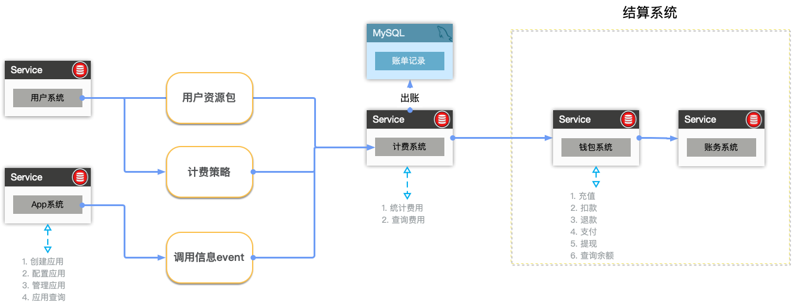
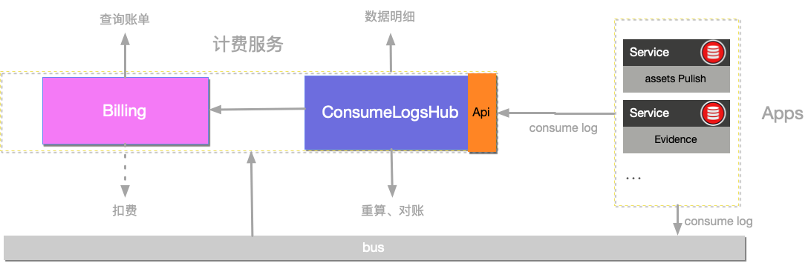

# Qilin-Contract 智能合约服务平台

## 一、设计概述

智能合约服务平台是链服生态中智能合约的管理平台，提供与智能合约交互与计费的基础服务，对外是智能合约的应用商店，客户在商店中按需购买业务合约模板的资源许可证，就可以调用相应的智能合约。

### 业务流程


- 计费


计费系统需要由上游的 `app系统和用户系统` 提供`请求数据、计费规则和用户信息、资源包等信息`作为输入;
计费系统将账单记录作为输出（存储在db），提供`消费查询功能`给外部系统使用;
### 功能概述

系统主要功能包括：

- 计费服务

使⽤者包括：

- 直接使用平台应用的企业用户
- 进行系统对接的企业系统

### ⾮功能约束

……系统未来预计⼀年⽤户量达到……， ⽇订单量达到……， ⽇PV达到……， 图⽚数量达到 ……。

1. 查询性能⽬标：平均响应时间<300ms，95%响应时间<500ms，单机TPS>100； 2. 下单性能⽬标：平均响应时间<800ms，95%响应时间<1000ms，单机TPS>30；

3. ……性能⽬标：平均响应时间<800ms，95%响应时间<1000ms，单机TPS>30；

4. 系统核⼼功能可⽤性⽬标：>99.97%；

5. 系统安全性⽬标：系统可拦截…… 、……、……攻击， 密码数据散列加密， 客户端数据 HTTPS加密，外部系统间通信对称加密；

6. 数据持久化⽬标：>99.99999%。

## 二、详细设计

### 应用模块

### 资源包模块
### 计费模块

采用流处理计费，伪实时的产生计费数据.

目前为会以分钟为时间周期记录每个租户在每个应用的账单（包含一分钟内消费和总消费），同时消耗用户资源包或扣除余额.
#### 系统架构



#### 各模块功能描述

```text
1. ConsumeLogsHub 获取所有应用产生的消费信息，对消费信息进行过滤、格式化、统计计量...
2. Billing 计算费用；费用 = 计量值 &（用户购买的资源包 + 计费策略）
```

#### 各模块细节设计

```text
1. ConsumeLogsHub 获取消费日志信息的方式有两种:
    1.1 所有平台应用都会在执行消费操作时（比如 创建存证）发送消费信息到平台消息队列;
    1.2 用户可以将以任何形式收集到的消费信息通过计费服务提供的 restful api传递到 ConsumeLogsHub 进行计量
2. Billing 通过corn形式定时计费
    2.1 获取一定时间范围的计量 
    2.2 获取租户拥有的应用资源包、租户使用的应用价格
    2.3 根据上面获取的信息统计费用（同时扣除用户余额或资源包条数）
```

#### 业务流程

 **1）创建消费日志**

```text
确认交易 （transaction cron Confirm）
1.确认交易状态成功 -> 创建消费日志 （App service CreateConsumerLog）
```

**2）统计费用**

```text
计费汇总（App cron）
1. 查询一定时间范围的计量（contract service Metering）
2. 查询租户拥有的应用资源包（App service ListLicenses 入参：todo）
3. 查询租户使用的应用价格（App service ListApps 入参：todo）
4. 计费并扣资源包和余额 （App service CreateAppStatistics）
```


