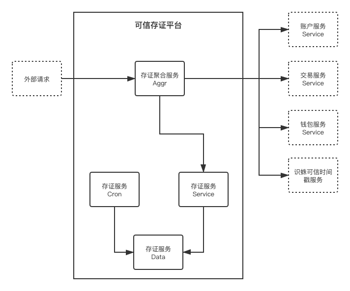

# Qilin-Evidence 可信存证服务平台

## 一、概述设计

可信存证服务平台是链服生态中由域乎官方提供的可信存证服务，底层使用的是域乎可信存证联盟链，是直接提供给外部机构使用的业务产品，承担着公司创收的⽬标任务。

### 功能概述

系统主要功能包括：

- 文件（PDF等等）、文本（文字内容）、摘要（文件、文本的hash值）的上链存证

- 存证内容的核验

使⽤者包括：
- 直接使用存证服务的企业用户
- 进行系统对接的企业系统

### ⾮功能约束

……系统未来预计⼀年⽤户量达到……， ⽇订单量达到……， ⽇PV达到……， 图⽚数量达到 ……。

1. 查询性能⽬标：平均响应时间<300ms，95%响应时间<500ms，单机TPS>100； 2. 下单性能⽬标：平均响应时间<800ms，95%响应时间<1000ms，单机TPS>30；

3. ……性能⽬标：平均响应时间<800ms，95%响应时间<1000ms，单机TPS>30；

4. 系统核⼼功能可⽤性⽬标：>99.97%；

5. 系统安全性⽬标：系统可拦截…… 、……、……攻击， 密码数据散列加密， 客户端数据 HTTPS加密，外部系统间通信对称加密；

6. 数据持久化⽬标：>99.99999%。

## 二、详细设计

系统上线时预计部署在公司标准K8S集群中，包含2个deployment服务，1个job服务，占用5～7个pod资源，RDS-MYSQL中占用1个数据库，RDS-REDIS中占用1个数据库，部署2个存证⼦系统，和链服生态系统中的账户服务、钱包服务、交易服务交互，和外部第三⽅（识蛛）的可信时间戳服务交互。

### 系统架构



```
1. platform admin 创建一个普通用户（iam aggr CreateUser）

2. platform admin 创建一个租户企业，并将刚才创建的普通用户设为 tenant admin（iam aggr CreateTenant）

3. tenant admin 进入租户空间，在基本信息中进行实名认证（iam aggr CreateTenantMeKYC）

4. tenant admin 使用创建存证功能（evid aggr CreateEvidence）

5. 后台使用之前传入的outTradeId查询（一致性补偿）交易状态，存证创建服务内容创建2分钟后再开始补偿确认（evid cron ConfirmEvidence）

6. tenant admin 可以查看到存证记录（evid aggr ListEvidence）

7. 普通用户核验存证记录（evid aggr VerifyEvidence）
```

### 创建存证场景系统流程

TODO: 图

tenant admin 使用创建存证功能（evid aggr CreateEvidence）

```
4.1. 获取 tenant admin 默认钱包（wallet service GetWalletMe）

4.2. 获取 tenant admin 企业认证信息（iam service ListTenantsKYC）

4.3. 创建存证事务，附带上企业认证信息，注：4.4存证创建失败，则存证事务作为脏数据存储在数据库中（evid service）

    4.3.1. （二阶段）后续增加识蛛的实名认证，并获取认证的时间戳

4.4. 创建存证，状态（builded）（evid service）

4.5. 调用交易服务发送交易，传入outTradeId作为幂等号（transaction service CreateTransaction）

    4.5.1. 创建交易任务，由于存证outTradeId，所以可以retry（transaction service CreateTransaction）

    4.5.2. 后台发送交易任务（transaction cron SendTransaction）

        4.5.2.1. Build交易

        4.5.2.2. 交易签名（wallet service Sign）

        4.5.2.3. 发送交易

    4.5.3. 后台确认交易任务（transaction cron ConfirmTransaction）

        4.5.3.1. 后台确认完成后，调用存证确认接口将成功、失败状态通过outTradeId返回给存证服务（evid server ConfirmEvidStatus）
```

### 存证状态一致性补偿场景系统流程

TODO: 图

后台使用之前传入的outTradeId查询（一致性补偿）交易状态，存证创建服务内容创建2分钟后再开始补偿确认（evid cron ConfirmEvidence）

```
5.1. 查询交易状态（transaction service）

    5.1.1. 返回查询状态（未找到->failed、发送中、成功->succeed、失败->failed），更新存证状态（succeed、failed）
```

## 三、子系统1设计（存证聚合子系统）

⼦系统1作为数据存证平台，所有外部请求的服务编排者，与内外部服务交互及数据聚合，最终将数据返回给请求方，其中只包含1个业务聚合组件。

## 四、子系统2设计（存证基础子系统）

⼦系统2主要的职责是提供中心化的数据存证服务，其中主要包含了4组件。

### 子系统组件结构关系

TODO: 图

⼦系统2包含4个组件： 

- 组件1（Service）的功能主要是提供业务逻辑处理， 需要依赖组件3、4完成数据持久化的工作， 是⼦系统2的核⼼组件。

- 组件2（Cron）的功能主要是提供定时任务处理， 需要依赖组件3、4完成数据持久化的工作， 同时还会依赖其他服务service client，来调用其他服务的业务逻辑。

- 组件3（Model）的功能主要是提供贫血模式的业务数据模型， 不依赖其他组件。

- 组件4（Data）的功能主要是提数据的获取和持久化， 不依赖其他组件，其内部分装各种持久化方式，如：mysql、redis、local_cache。

### 创建存证事务功能组件流程

TODO: 图

### 创建摘要存证功能组件流程

TODO: 图

### 组件1类图

TODO: 图

EvidenceService interface

```go
type EvidenceServiceServer interface {
	CreateEVIDTrans(context.Context, *CreateEVIDTransRequest) (*CreateEVIDTransResponse, error)
	CreateDigestEvidence(context.Context, *CreateDigestEvidenceRequest) (*CreateDigestEvidenceResponse, error)
	CreateFileEvidence(context.Context, *CreateFileEvidenceRequest) (*CreateFileEvidenceResponse, error)
	CreateTextEvidence(context.Context, *CreateTextEvidenceRequest) (*CreateTextEvidenceResponse, error)
	GetEvidence(context.Context, *GetEvidenceRequest) (*GetEvidenceResponse, error)
	ListEvidences(context.Context, *ListEvidencesRequest) (*ListEvidencesResponse, error)
	ConfirmEvidence(context.Context, *ConfirmEvidenceRequest) (*empty.Empty, error)
}
```

### 组件2类图

cron

### 组件3类图

TODO: 图

Evidence model

```go
type Evidence struct {
	EvidenceId  string    `gorm:"column:evidence_id;primary_key"`
	CreateTime  time.Time `gorm:"column:create_time;default:CURRENT_TIMESTAMP;NOT NULL"`
	EvidtransId string    `gorm:"column:evidtrans_id;NOT NULL"`
	WalletId    string    `gorm:"column:wallet_id;NOT NULL"`
	Title       string    `gorm:"column:title;NOT NULL"`
	EvidType    string    `gorm:"column:evid_type;NOT NULL"` // text,digest,file
	Digest      string    `gorm:"column:digest"`
	Txhash      string    `gorm:"column:txhash;unique"`
	Status      string    `gorm:"column:status;NOT NULL"` // builded,succeed,failed
	PushTime    time.Time `gorm:"column:push_time;NOT NULL"`
	Tsr         int       `gorm:"column:tsr;NOT NULL"`
	Owner       string    `gorm:"column:owner"`
	GroupId     string    `gorm:"column:group_id"`
	TenantId    string    `gorm:"column:tenant_id"`
	Extra       string    `gorm:"column:extra"`
}

type EvidenceContent struct {
	EvidenceId string `gorm:"column:evidence_id;primary_key"`
	RawText    string `gorm:"column:raw_text"`
	FilePath   string `gorm:"column:file_path"`
}
```

Evidtrans model

```go
type Evidtrans struct {
	EvidtransId    string    `gorm:"column:evidtrans_id;primary_key"`
	CreateTime     time.Time `gorm:"column:create_time;default:CURRENT_TIMESTAMP;NOT NULL"`
	OrgName        string    `gorm:"column:org_name;NOT NULL"`
	OrgCode        string    `gorm:"column:org_code;NOT NULL"`
	LegalRepName   string    `gorm:"column:legal_rep_name;NOT NULL"`
	LegalRepIdCard string    `gorm:"column:legal_rep_id_card;NOT NULL"`
	Status         string    `gorm:"column:status;NOT NULL"` // builded,succeed,failed
	Owner          string    `gorm:"column:owner"`
	GroupId        string    `gorm:"column:group_id"`
	TenantId       string    `gorm:"column:tenant_id"`
	Extra          string    `gorm:"column:extra"`
}

type EvidenceTransBinding struct {
	BindId      string    `gorm:"column:bind_id;primary_key"`
	EvidenceId  string    `gorm:"column:evidence_id;NOT NULL"`
	EvidtransId string    `gorm:"column:evidtrans_id;NOT NULL"`
	CreateTime  time.Time `gorm:"column:create_time;default:CURRENT_TIMESTAMP;NOT NULL"`
}
```

### 组件4类图

TODO: 图

EvidenceData interface

```go
type EvidenceInterface interface {
	//TODO 接口定义
}
```

## 五、聚合层接口文档

### 1.创建可信存证

接口描述：存证创建上链

接口地址：http://localhost:10100/v1/app/evid/create

### 2.创建核验令牌

接口描述：

接口地址：http://localhost:10100/v1/app/evid/verifytoken

### 3.存证核验

接口描述：核验存证数据。

接口地址：http://localhost:10100/v1/app/evid/verify

## 六、服务层接口文档

### 1.创建事务

接口描述：

接口地址：qilin.basic.evidence.v1.CreateEVIDTrans

### 2.创建摘要存证

接口描述：摘要形式存证，可以用于电子文本、文件数据摘要的存证。包含存证元数据、摘要数据。

接口地址：qilin.basic.evidence.v1.CreateDigestEvidence

### 3.创建原文本存证

接口描述：文本形式存证，可以用户电子文本数据的存证。包含存证元数据，存证文本。

接口地址：qilin.basic.evidence.v1.CreateTextEvidence

### 4.创建原文件存证

接口描述：文件形式存证，可以用户电子文件数据的存证。包含存证元数据，存证文件。

接口地址：qilin.basic.evidence.v1.CreateFileEvidence

### 5.获取摘要存证

接口描述：获取存证摘要数据。

接口地址：

### 6.获取原文本存证

接口描述：获取存文本要数据。

接口地址：

### 7.获取原文件存证

接口描述：获取存证文件数据。

接口地址：

### 8.获取区块链存证信息

接口描述：获取区块链交易数据。

接口地址：

### 9.创建核验令牌

接口描述：

接口地址：

### 10.存证摘要核验

接口描述：核验文本要数据。

接口地址：qilin.basic.evidence.v1.GetEvidence

### 11.存证原文本核验

接口描述：核验存文本要数据。

接口地址：qilin.basic.evidence.v1.GetEvidence

### 12.存证原文件核验

接口描述：核验存证文件数据。

接口地址：qilin.basic.evidence.v1.GetEvidence
