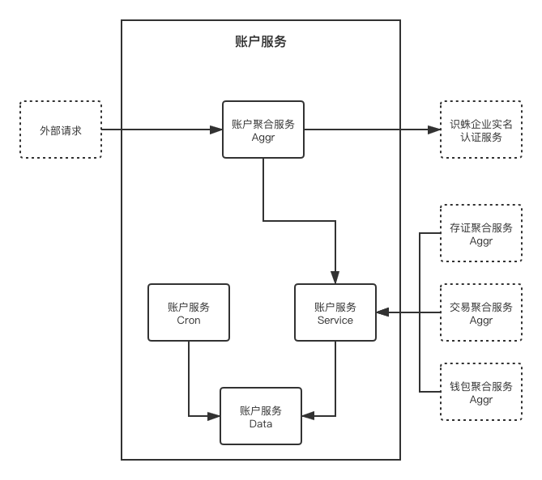

# Qilin-IAM 账户服务

## 一、设计概述

账户服务提供链服生态中用户、租户、认证、授权的基础服务，不是独立的业务产品，是链服平台中所有其他业务都会依赖的核心服务。

### 功能概述

系统主要功能包括：


- 访问控制：
    - 账户登录
    - 账户管理
    - 账户角色
    - 租户管理

- 租户空间：
    - 基本信息
        - 企业实名认证
    - 租户角色
    - 租户成员
    - 组织结构

使⽤者包括：

- 链服生态内所有业务平台

### ⾮功能约束

……系统未来预计⼀年⽤户量达到……， ⽇订单量达到……， ⽇PV达到……， 图⽚数量达到 ……。

1. 查询性能⽬标：平均响应时间<300ms，95%响应时间<500ms，单机TPS>100； 2. 下单性能⽬标：平均响应时间<800ms，95%响应时间<1000ms，单机TPS>30；

3. ……性能⽬标：平均响应时间<800ms，95%响应时间<1000ms，单机TPS>30；

4. 系统核⼼功能可⽤性⽬标：>99.97%；

5. 系统安全性⽬标：系统可拦截…… 、……、……攻击， 密码数据散列加密， 客户端数据 HTTPS加密，外部系统间通信对称加密；

6. 数据持久化⽬标：>99.99999%。

## 二、详细设计

系统上线时预计部署在公司标准K8S集群中，包含2个deployment服务，占用4～6个pod资源，RDS-MYSQL中占用1个数据库，RDS-REDIS中占用1个数据库，部署2个存证⼦系统，和外部第三⽅（识蛛）的实名认证服务交互。

### 系统架构



```
1. platform admin 创建一个普通用户（iam aggr CreateUser）

2. platform admin 创建一个租户企业，并将刚才创建的普通用户设为 tenant admin（iam aggr CreateTenant）

3. tenant admin 进入租户空间，在基本信息中进行实名认证（iam aggr CreateTenantMeKYC）

```

### 用户账号/密码登录流程

TODO: 图

### 用户ak/sk编程登录流程

TODO: 图

### 租户企业实名认证流程

TODO: 图

## 三、子系统1设计（账户聚合子系统）

⼦系统1作为账户系统，所有外部请求的服务编排者，与内外部服务交互及数据聚合，最终将数据返回给请求方，其中只包含1个业务聚合组件。

## 四、子系统2设计（账户基础子系统）

⼦系统2主要的职责是提供中心化的账户服务，其中主要包含了4组件。

### 子系统组件结构关系

TODO: 图

⼦系统2包含4个组件： 

- 组件1（Service）的功能主要是提供业务逻辑处理， 需要依赖组件3、4完成数据持久化的工作， 是⼦系统2的核⼼组件。

- 组件2（Cron）的功能主要是提供定时任务处理， 需要依赖组件3、4完成数据持久化的工作， 同时还会依赖其他服务service client，来调用其他服务的业务逻辑。

- 组件3（Model）的功能主要是提供贫血模式的业务数据模型， 不依赖其他组件。

- 组件4（Data）的功能主要是提数据的获取和持久化， 不依赖其他组件，其内部分装各种持久化方式，如：mysql、redis、local_cache。

### 用户账号/密码登录功能组件流程

TODO: 图

### 用户ak/sk编程登录功能组件流程

TODO: 图

### 组件1类图

TODO: 图

AuthServiceServer interface

TenantServiceServer interface

IMServiceServer interface

AMServiceServer interface

GroupServiceServer interface

### 组件2类图

cron

### 组件3类图

TODO: 图

### 组件4类图

TODO: 图

## 五、聚合层接口文档

### 1.账户登录

接口描述：

接口地址：http://localhost:10100/v1/app/auth/token

### 2.获取账户列表

接口描述：

接口地址：http://localhost:10100/v1/admin/users

### 3.创建租户

接口描述：

接口地址：http://localhost:10100/v1/admin/tenants

## 六、服务层接口文档

### 1.使用账号密码创建 token

接口描述：

接口地址：qilin.basic.iam.v1.NewToken

### 2.使用 refresh token 刷新 token

接口描述：

接口地址：qilin.basic.iam.v1.RefreshToken

### 3.创建账户

接口描述：

接口地址：qilin.basic.iam.v1.CreateUser

### 4.创建租户

接口描述：

接口地址：qilin.basic.iam.v1.CreateTenant

### 5.获取租户实名认证状态列表

接口描述：

接口地址：qilin.basic.iam.v1.ListTenantsKYC
