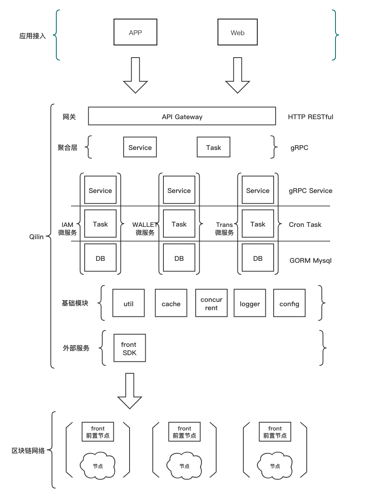

##############################################################
Qilin 技术文档
##############################################################

Qilin 是在区块链应用和FISCO-BCOS节点之间搭建的一套通用组件。围绕交易、存证、钱包管理，数据，可视化管理来设计各个模块，开发者可以根据业务所需，选择子系统进行部署。Qilin屏蔽了区块链底层的复杂度，降低开发者的门槛，大幅提高区块链应用的开发效率，包含节点前置、节点管理、交易服务，存证服务，Web管理平台等子系统。

- `Github主页 <https://github.com/yuhu-tech/Qilin>`_   

建立区块链应用开发标准
--------------------------------------------------
Qilin将区块链应用开发标准化，按照部署、配置、开发智能合约、开发应用层、在线运维管理五个步骤即可完成一个区块链应用的开发，详细开发流程请参阅 `使用Qilin开发区块链应用 <./docs/qilin/quick-start.html>`_

设计原则
--------------------------------------------------
**按需部署**
Qilin抽象应用开发的诸多共性模块，形成各类服务组件，开发者根据需要部署所需组件。

**微服务**
Qilin采用微服务架构，基于Backend框架，提供RESTful风格接口。

**零耦合**
Qilin所有子系统独立存在，均可独立部署，独立提供服务。

**可定制**
前端页面往往带有自身的业务属性，因此Qilin采用前后端分离的技术，便于开发者基于后端接口定制自己的前端页面。

整体架构
--------------------------------------------------
完整的部署架构如下，其中Qilin-Front需要和区块链节点同机部署。

各子系统简介
--------------------------------------------------
节点前置服务
>>>>>>>>>>>>>>>>>>>>>>>>>>>>>>>>>>>>>>>>>>>>>>>>>>
`Qilin-Front <./docs/qilin-front/index.html>`_ 集成go-sdk，提供RESTful风格的接口，客户端可以使用http的形式和节点进行交互。

钱包服务
>>>>>>>>>>>>>>>>>>>>>>>>>>>>>>>>>>>>>>>>>>>>>>>>>>
`Qilin-Wallet <./docs/qilin-wallet/index.html>`_
钱包服务以http请求的形式，提供给用户创建钱包和私钥接口的服务。用户可以轻松的调用“创建钱包”或者“批量创建钱包”的接口以获取钱包地址，钱包的私钥将被托管在本服务中。当需要使用创建的钱包发送交易或其他操作时，直接使用钱包地址即可。

交易服务
>>>>>>>>>>>>>>>>>>>>>>>>>>>>>>>>>>>>>>>>>>>>>>>>>>
`Qilin-Transaction <./docs/qilin-transaction/index.html>`_
交易服务提供给用户往区块链调用合约的http接口。本服务提供给用户两类接口，一类是通用的调用合约的接口，用户需要传入合约地址，被调用的合约方法名，以及调用参数来发送交易；另一类接口是定制的调用合约的接口，将常用的合约的方法抽象出来，用户无需关心具体被调用的方法名，仅需要传入合约地址以及定制的参数即可完成对合约方法的调用。

存证服务
>>>>>>>>>>>>>>>>>>>>>>>>>>>>>>>>>>>>>>>>>>>>>>>>>>
`Qilin-Evidence <./docs/qilin-evidence/index.html>`_
存证服务提供给用户将数据存储上链的接口。用户通过调用本服务的接口，可以自由的创建数据表，往数据表里插入数据，更新数据，或者查询数据。

统计服务
>>>>>>>>>>>>>>>>>>>>>>>>>>>>>>>>>>>>>>>>>>>>>>>>>>
`Qilin-Statistics <./docs/qilin-statistics/index.html>`_
统计服务会实时的将链上的交易同步下来，并对交易进行解析和出来，使其转化为用户感兴趣的数据，并提供http的接口以供调用。

.. toctree::
   :hidden:
   :maxdepth: 2

   ./docs/qilin/quick-start.md
   ./docs/qilin-front/index.md
   ./docs/qilin-wallet/index.md
   ./docs/qilin-transaction/index.md
   ./docs/qilin-evidence/index.md
   ./docs/qilin-statistics/index.md