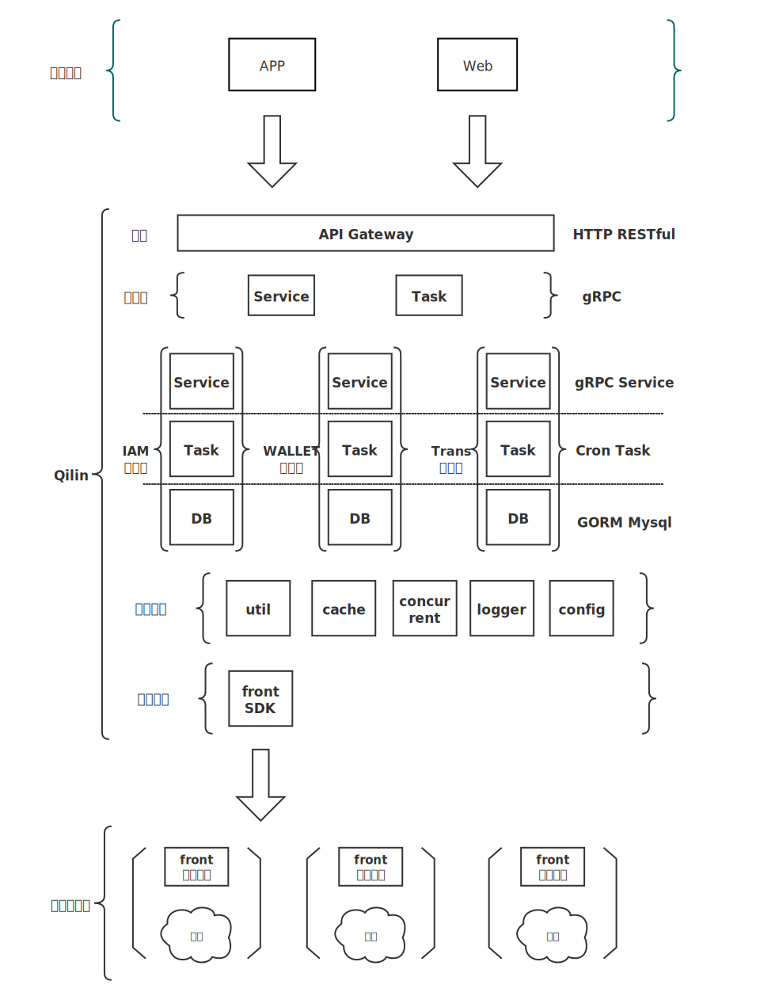

##############################################################
Qilin 技术文档
##############################################################

.. image:: _static/images/qilin_logo.png

Qilin 是在区块链应用和FISCO-BCOS节点之间搭建的一套通用组件。围绕交易、存证、钱包管理，数据，可视化管理来设计各个模块，开发者可以根据业务所需，选择子系统进行部署。Qilin屏蔽了区块链底层的复杂度，降低开发者的门槛，大幅提高区块链应用的开发效率，包含节点前置、节点管理、交易服务，存证服务，Web管理平台等子系统。

- `Github主页 <https://github.com/yuhu-tech/Qilin>`_   

建立区块链应用开发标准
--------------------------------------------------
Qilin将区块链应用开发标准化，按照部署、配置、开发智能合约、开发应用层、在线运维管理五个步骤即可完成一个区块链应用的开发，详细开发流程请参阅 `使用Qilin开发区块链应用 <./docs/qilin/quick-start.html>`_

设计原则
--------------------------------------------------
**按需部署**
Qilin抽象应用开发的诸多共性模块，形成各类服务组件，开发者根据需要部署所需组件。

**微服务**
Qilin采用微服务架构，基于Backend框架，提供RESTful风格接口。

**零耦合**
Qilin所有子系统独立存在，均可独立部署，独立提供服务。

**可定制**
前端页面往往带有自身的业务属性，因此Qilin采用前后端分离的技术，便于开发者基于后端接口定制自己的前端页面。

整体架构
--------------------------------------------------
完整的部署架构如下，其中Qilin-Front需要和区块链节点同机部署。

各子系统简介
--------------------------------------------------
节点前置服务
>>>>>>>>>>>>>>>>>>>>>>>>>>>>>>>>>>>>>>>>>>>>>>>>>>
`Qilin-Front <./docs/qilin-front/index.html>`_ 集成go-sdk，提供RESTful风格的接口，客户端可以使用http的形式和节点进行交互。

钱包服务
>>>>>>>>>>>>>>>>>>>>>>>>>>>>>>>>>>>>>>>>>>>>>>>>>>
`Qilin-Wallet <./docs/qilin-wallet/index.html>`_

交易服务
>>>>>>>>>>>>>>>>>>>>>>>>>>>>>>>>>>>>>>>>>>>>>>>>>>
`Qilin-Transaction <./docs/qilin-transaction/index.html>`_

存证服务
>>>>>>>>>>>>>>>>>>>>>>>>>>>>>>>>>>>>>>>>>>>>>>>>>>
`Qilin-Evidence <./docs/qilin-evidence/index.html>`_

统计服务
>>>>>>>>>>>>>>>>>>>>>>>>>>>>>>>>>>>>>>>>>>>>>>>>>>
`Qilin-Statistics <./docs/qilin-statistics/index.html>`_