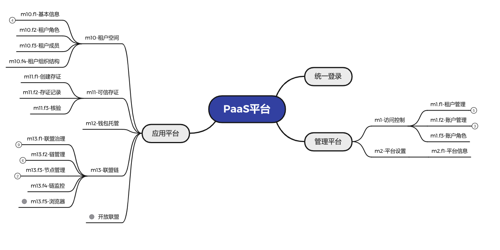

##############################################################
Qilin 技术文档
##############################################################

Qilin 是在区块链应用和区块链节点之间搭建的一套通用组件。围绕交易、钱包、合约管理，数据，可视化管理来设计各个模块，开发者可以根据业务所需，选择子系统进行部署。Qilin屏蔽了区块链底层的复杂度，降低开发者的门槛，大幅提高区块链应用的开发效率，包含账户服务，交易服务，钱包服务，可信存证服务平台、资产服务平台、溯源服务平台等子系统。

- `Github主页 <https://github.com/yuhu-tech/Qilin>`_   

建立区块链应用开发标准
--------------------------------------------------
Qilin将区块链应用开发标准化，按照部署、配置、开发智能合约、开发应用层、在线运维管理五个步骤即可完成一个区块链应用的开发，详细开发流程请参阅 `使用Qilin开发区块链应用 <./docs/qilin/quick-start.html>`_

整体架构
--------------------------------------------------
业务架构

技术架构

功能列表

各子系统简介
--------------------------------------------------
账户服务
>>>>>>>>>>>>>>>>>>>>>>>>>>>>>>>>>>>>>>>>>>>>>>>>>>
`Qilin-IAM <./docs/qilin-iam/index.html>`_
账户服务提供链服生态中用户、租户、认证、授权的基础服务，不是独立的业务产品，是链服平台中所有其他业务都会依赖的核心服务。

联盟链服务
>>>>>>>>>>>>>>>>>>>>>>>>>>>>>>>>>>>>>>>>>>>>>>>>>>
`Qilin-BaaS <./docs/qilin-baas/index.html>`_
联盟链服务提供链服生态中联盟治理，链与节点的管理与监控的基础服务，给客户提供自建底层区块链及节点的能力，是链服平台中所有区块链服务都会依赖的核心服务。

钱包服务
>>>>>>>>>>>>>>>>>>>>>>>>>>>>>>>>>>>>>>>>>>>>>>>>>>
`Qilin-Wallet <./docs/qilin-wallet/index.html>`_
钱包服务给用户提供钱包密钥托管服务及代理签名服务。用户可以轻松的调用“创建钱包”或者“批量创建钱包”的接口以获取钱包地址，钱包的私钥将被托管在本服务中。使用托管的钱包发送交易或其他操作时，可由系统进行代理签名。

交易服务
>>>>>>>>>>>>>>>>>>>>>>>>>>>>>>>>>>>>>>>>>>>>>>>>>>
`Qilin-Transaction <./docs/qilin-transaction/index.html>`_
交易服务提供给用户往区块链调用合约的http接口。本服务提供给用户两类接口，一类是通用的调用合约的接口，用户需要传入合约地址，被调用的合约方法名，以及调用参数来发送交易；另一类接口是定制的调用合约的接口，将常用的合约的方法抽象出来，用户无需关心具体被调用的方法名，仅需要传入合约地址以及定制的参数即可完成对合约方法的调用。

智能合约服务平台
>>>>>>>>>>>>>>>>>>>>>>>>>>>>>>>>>>>>>>>>>>>>>>>>>>
`Qilin-Contract <./docs/qilin-contract/index.html>`_
智能合约服务平台是链服生态中智能合约的管理平台，提供与智能合约交互与计费的基础服务，对外是智能合约的应用商店，客户在商店中按需购买业务合约模板的资源许可证，就可以调用相应的智能合约。

可信存证服务平台
>>>>>>>>>>>>>>>>>>>>>>>>>>>>>>>>>>>>>>>>>>>>>>>>>>
`Qilin-Evidence <./docs/qilin-evidence/index.html>`_
存证服务提供给用户提供可信数据存储、核验服务。使用本服务的租户必须通过企业4要素实名认证，存证数据将被存储在域乎可信存证链上，上链时间根据国标《电子数据存证技术规范》提供可信时间戳。

资产服务平台
>>>>>>>>>>>>>>>>>>>>>>>>>>>>>>>>>>>>>>>>>>>>>>>>>>
`Qilin-Assets <./docs/qilin-assets/index.html>`_

.. toctree::
   :hidden:
   :maxdepth: 2

   ./docs/qilin/quick-start.md
   ./docs/qilin-iam/index.md
   ./docs/qilin-baas/index.md
   ./docs/qilin-wallet/index.md
   ./docs/qilin-transaction/index.md
   ./docs/qilin-contract/index.md
   ./docs/qilin-evidence/index.md
   ./docs/qilin-assets/index.md